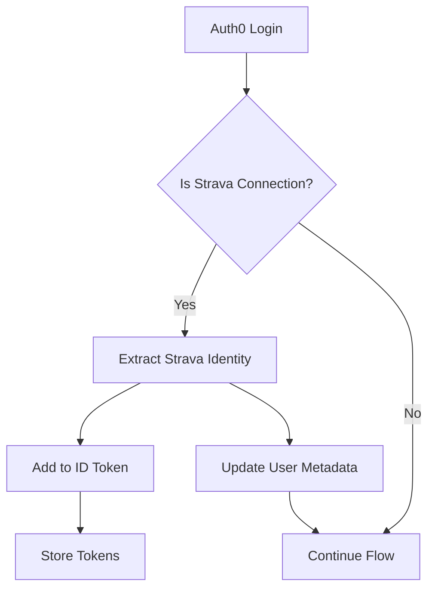
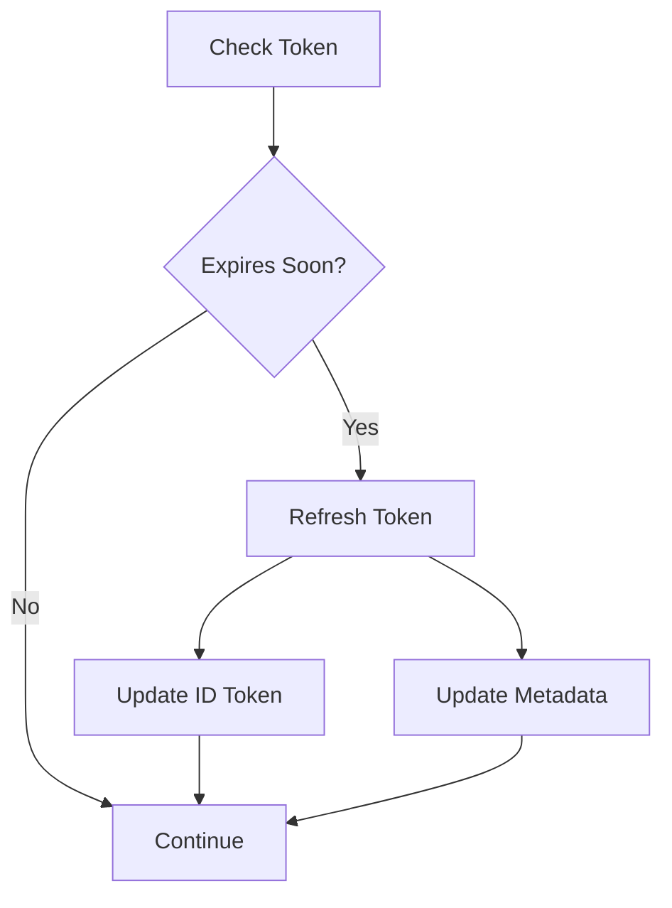

# Auth0 Rule System Documentation

## Overview

The Auth0 rule system for FlowStake handles user authentication, Strava integration, and activity synchronization through a series of rules and hooks that execute during the authentication flow.

## Configuration

### Environment Variables

```env
# Auth0 Configuration
VITE_AUTH0_DOMAIN=dev-t0svn2hdswfwani8.us.auth0.com
VITE_AUTH0_CLIENT_ID=vpMxu7PxdGIUVFBC1Q3zGeMKcGYdjtsy
VITE_AUTH0_CLIENT_SECRET=QDHGamR1bgprw7SaysslqhZSMrvkYP1nh32WdrNhFA2DmvjlRo
VITE_AUTH0_AUDIENCE=https://api.flowstake.com

# Rule-specific Settings
AUTH0_WEBHOOK_URL=https://api.flowstake.com
AUTH0_API_TOKEN=your_api_token_here
AUTH0_STRAVA_CLIENT_ID=39273
AUTH0_STRAVA_CLIENT_SECRET=891d284ec347b97587141db14e1f0e6ec05a4b9c
```

### Rule Configuration

In Auth0 Dashboard:

1. Go to Auth0 Dashboard > Rules
2. Create rules in the following order:
   - Strava Connection (Order: 1)
   - Activity Sync (Order: 2)
   - Token Refresh (Order: 3)

### Rule Settings

Configure the following in Auth0 Dashboard > Rules > Settings:

```json
{
  "WEBHOOK_URL": "https://api.flowstake.com",
  "API_TOKEN": "your_api_token_here",
  "STRAVA_CLIENT_ID": "39273",
  "STRAVA_CLIENT_SECRET": "891d284ec347b97587141db14e1f0e6ec05a4b9c"
}
```

## Rules Documentation

### 1. Strava Connection Rule

**Purpose**: Handles initial Strava connection and stores athlete data.

**Functionality**:
- Captures Strava identity information
- Stores tokens in ID token
- Updates user metadata with athlete details

**Data Flow**:


### 2. Activity Sync Rule

**Purpose**: Triggers background synchronization of Strava activities.

**Functionality**:
- Schedules activity sync via webhook
- Tracks sync timestamps
- Maintains activity history

**Configuration**:
```json
{
  "webhook": {
    "endpoint": "/sync-activities",
    "method": "POST",
    "headers": {
      "Content-Type": "application/json",
      "Authorization": "Bearer ${API_TOKEN}"
    }
  }
}
```

### 3. Token Refresh Rule

**Purpose**: Manages Strava token lifecycle.

**Functionality**:
- Monitors token expiration
- Handles automatic refresh
- Updates stored tokens

**Token Lifecycle**:


## Post-Login Hook

**Purpose**: Handles additional setup after successful login.

**Functionality**:
- Updates app metadata
- Tracks Strava connection status
- Records login timestamps

## User Metadata Schema

### User Metadata
```json
{
  "strava": {
    "athlete_id": "string",
    "athlete_name": "string",
    "profile": "string",
    "city": "string",
    "country": "string",
    "last_sync": "ISO8601 DateTime"
  }
}
```

### App Metadata
```json
{
  "has_strava": "boolean",
  "last_login": "ISO8601 DateTime"
}
```

## ID Token Claims

```json
{
  "https://flowstake.com/strava": {
    "access_token": "string",
    "refresh_token": "string",
    "expires_at": "number",
    "athlete_id": "string",
    "athlete_name": "string",
    "profile_medium": "string",
    "profile": "string"
  },
  "https://flowstake.com/last_sync": "ISO8601 DateTime"
}
```

## Security Considerations

1. **Token Storage**:
   - Access tokens stored in ID token
   - Refresh tokens in secure metadata
   - No client-side token storage

2. **Permissions**:
   - Minimal scope requirements
   - Activity-specific permissions
   - Read-only access where possible

3. **Error Handling**:
   - Graceful failure handling
   - Continued auth flow on errors
   - Detailed error logging

## Implementation Guide

1. **Auth0 Setup**:
   ```bash
   # Install dependencies
   npm install @auth0/auth0-react

   # Configure environment
   cp .env.example .env
   ```

2. **Rule Deployment**:
   - Copy rule scripts from `/src/config/auth0/rules`
   - Deploy in correct order via Auth0 Dashboard
   - Configure rule settings

3. **Frontend Integration**:
   ```typescript
   // Initialize Auth0Provider
   import { Auth0Provider } from '@auth0/auth0-react';
   import { auth0Config } from './config/auth0';

   <Auth0Provider
     domain={auth0Config.domain}
     clientId={auth0Config.clientId}
     authorizationParams={{
       redirect_uri: auth0Config.redirectUri,
       audience: auth0Config.audience,
       scope: auth0Config.scope
     }}
   >
     <App />
   </Auth0Provider>
   ```

## Troubleshooting

### Common Issues

1. **Token Refresh Failures**:
   - Check token expiration
   - Verify refresh token validity
   - Confirm Strava API status

2. **Activity Sync Issues**:
   - Validate webhook endpoint
   - Check API token
   - Review rate limits

3. **Connection Problems**:
   - Verify Auth0 configuration
   - Check Strava app settings
   - Confirm redirect URIs

### Debugging

Enable debug logging in Auth0 Dashboard:

```javascript
// Add to rule scripts
const DEBUG = true;

if (DEBUG) {
  console.log('Rule execution:', {
    user: user.user_id,
    connection: context.connection,
    timestamp: new Date().toISOString()
  });
}
```

## Monitoring

### Metrics to Track

1. **Authentication**:
   - Login success rate
   - Token refresh rate
   - Error frequency

2. **Integration**:
   - Strava connection success
   - Activity sync completion
   - API response times

3. **Performance**:
   - Rule execution time
   - Webhook latency
   - Token refresh timing

### Logging

Configure logging in Auth0 Dashboard:

```javascript
function logMetric(name, value, tags = {}) {
  auth0.logs.create({
    type: 'metric',
    description: name,
    details: {
      value,
      tags,
      timestamp: Date.now()
    }
  });
}
```

## Best Practices

1. **Rule Management**:
   - Keep rules focused and simple
   - Maintain correct execution order
   - Handle errors gracefully

2. **Token Handling**:
   - Implement proper refresh logic
   - Secure token storage
   - Regular token validation

3. **Performance**:
   - Minimize rule execution time
   - Batch metadata updates
   - Optimize API calls

## Support and Resources

- [Auth0 Documentation](https://auth0.com/docs)
- [Strava API Reference](https://developers.strava.com/docs/reference/)
- [FlowStake Support](https://flowstake.com/support)